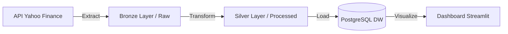
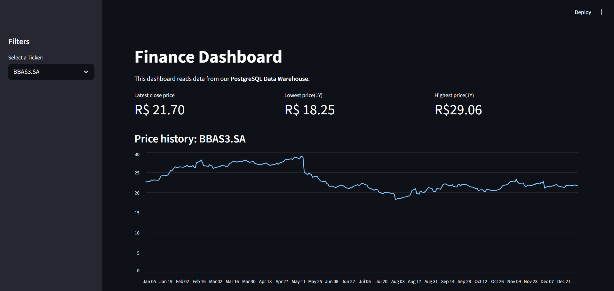

<!-- CABEÇALHO -->

<div align="center">
<h1>💰 Pipeline de Dados Financeiros (ETL)</h1>
<p><b>Dos Dados Brutos ao Dashboard Interativo</b></p>
<p>Projeto prático de Engenharia de Dados para monitoramento de ações da B3.</p>

<!-- BADGES -->
<p>


</p>
</div>

---

## 📖 Sobre o Projeto

Este projeto implementa um pipeline **End-to-End de Engenharia de Dados**, responsável por automatizar a coleta, tratamento, armazenamento e visualização de dados do mercado financeiro brasileiro.

O sistema realiza a extração diária de cotações de ações estratégicas da B3 (PETR4, VALE3, ITUB4, WEGE3, BBAS3), aplica processos de limpeza e padronização para garantir qualidade dos dados e armazena as informações em um **Data Warehouse PostgreSQL**. Por fim, os dados são consumidos por um **dashboard interativo em Streamlit**.

---

## 🏗️ Arquitetura do Pipeline

O fluxo de dados segue a arquitetura de medalhão (Bronze / Silver):



### Etapas do ETL

- **🟢 Extração (`extract.py`)**  
  Coleta dados históricos da API Yahoo Finance e salva arquivos no formato **Parquet** na camada *Bronze* (`data/raw`).

- **🟡 Transformação (`transform.py`)**  
  Limpeza e padronização dos dados com **Pandas**, incluindo:
  - Normalização de nomes de colunas (snake_case)
  - Conversão correta de tipos (datas e valores numéricos)
  - Tratamento de dados faltantes  
  Os dados tratados são salvos na camada *Silver* (`data/processed`).

- **🔵 Carga (`load.py`)**  
  Ingestão dos dados processados em um banco **PostgreSQL**, executando dentro de containers Docker.

- **🔴 Visualização (`dashboard.py`)**  
  Dashboard web desenvolvido com **Streamlit**, permitindo acompanhar a variação histórica dos preços das ações.

---

## 🛠️ Tech Stack

| Componente        | Tecnologia     | Função no Projeto |
|------------------|----------------|-------------------|
| Orquestração     | Python         | Execução sequencial do ETL (`pipeline.py`) |
| Containerização  | Docker         | Isolamento do banco e do PGAdmin |
| Banco de Dados   | PostgreSQL     | Data Warehouse de cotações |
| Processamento    | Pandas         | Limpeza e transformação dos dados |
| Armazenamento    | Parquet        | Formato colunar otimizado |
| Frontend         | Streamlit      | Dashboard interativo |
| API              | yfinance       | Extração de dados financeiros |

---

## 📊 Resultado

O resultado final é um **dashboard interativo**, que permite visualizar a evolução histórica dos preços das ações monitoradas.

<div align="center">

</div>

---

## 🚀 Como Rodar Localmente

### 1. Pré-requisitos

Certifique-se de ter instalado:

- Docker Desktop (em execução)
- Python 3.10 ou superior
- Git

---

### 2. Instalação

Clone o repositório e configure o ambiente Python:

```bash
# Clone o repositório
git clone https://github.com/arthuurca/ProjetoEngenhariadeDados.git
cd ProjetoEngenhariadeDados

# Criar ambiente virtual
python -m venv .venv

# Ativar ambiente (Windows)
.\.venv\Scripts\activate

# Ativar ambiente (Linux/Mac)
source .venv/bin/activate

# Instalar dependências
pip install -r requirements.txt
```

---

### 3. Subir a Infraestrutura

Inicie o PostgreSQL e o PGAdmin com Docker:

```bash
docker-compose up -d
```

---

### 4. Executar o Pipeline ETL

Execute o orquestrador do pipeline:

```bash
python pipeline.py
```

O terminal exibirá logs indicando o sucesso de cada etapa (**Extract → Transform → Load**).

---

### 5. Abrir o Dashboard

Para visualizar os dados processados:

```bash
streamlit run src/dashboard.py
```

A aplicação estará disponível em: **http://localhost:8501**

---

## 📂 Estrutura de Pastas

```text
finance-etl/
├── data/
│   ├── raw/                # Camada Bronze (dados brutos)
│   └── processed/          # Camada Silver (dados tratados)
├── src/
│   ├── extract.py          # Extração (Yahoo Finance)
│   ├── transform.py        # Transformação (Pandas)
│   ├── load.py             # Carga (PostgreSQL)
│   └── dashboard.py        # Dashboard Streamlit
├── docker-compose.yml      # Infraestrutura Docker
├── pipeline.py             # Orquestrador do ETL
├── requirements.txt        # Dependências Python
└── README.md               # Documentação
```

---

<div align="center">
<p>Desenvolvido por <b>Arthur Carvalho</b></p>

<a href="https://www.linkedin.com/in/arthur-vinicius-95b614239/">

</a>
<a href="mailto:arthurcontactbr@gmail.com">

</a>
</div>

